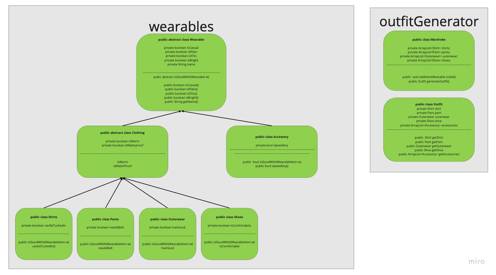

## The object Hierarchy of my Outfit Generator



## Why did I design it this way?

I chose this hierarchy as it made logical sense to me to split up the different Outfit components this way.
My Abstract class Wearable is the blueprint for all of the Outfit components and has the bulk of the methods. I originally planned to have everything inherit directly
from the Wearable class, however upon creating my diagram I noticed that there were methods common to all non-accessory Objects, so I decided to create a Clothing class to
house these methods and make for more DRY code.

I chose to implement a polymorphic abstract isGoodWith() method in the Wearable class. Having this method will allow me to write very granular rules for each different Outfit
constituent, and due to it's encapsulation give me the best option for adding additional rules in future.

I also decided to implement a Wardrobe class that will hold all possible clothing items, and an Outfit class for the generated combinations themselves.

## What characteristics do I cehck for when creating an outfit

The characteristics I track for each item are listed below:

#### all items:

    * isCasual
    * isplain
    * isChic
    * isBright

#### clothing:

    * isWarm
    * isWaterproof

#### Accessories:

    * isJewellery

#### Shirts:

    * canBeTuckedIn

#### Pants:

    * needsBelt

#### Outerwear:

    * hasHood

#### Shoes:

    * isComfortable

## What rules do I use to decide a good outfit

These are the current rules for a fashionable outfit according to my program, however due to the way I have set up my class hierarchy and the way I have implemented the checking for
a valid outfit, new rules are easily added.

- If the shirt is bright then everything else must be bright too
- If a pant needs a belt then it can't be worn with casual items
- If pants are waterproof, then outerwear must be waterproof also
- If outerwear has a hood pants must be waterproof
- If shoes are bright then pants need to be plain

The rules themselves are simple If statements in a classes isGoodWith method, a few examples are below:

If the shirt is bright then everything else must be bright too

```
if (this.isBright() && !w.isBright()) { return false; }
```

If a pant needs a belt it can't be worn with casual items

```
if (this.needsBelt() && w.isCasual()) { return false; }
```

Implementing new rules is very easy, for instance, if I wanted to implement a rule that comfortable shoes can only be worn with casual items I would add the following to the
isGoodWith method of my Shoe class:

```
if (this.isComfortable() && !w.isCasual()) { return false; }
```
